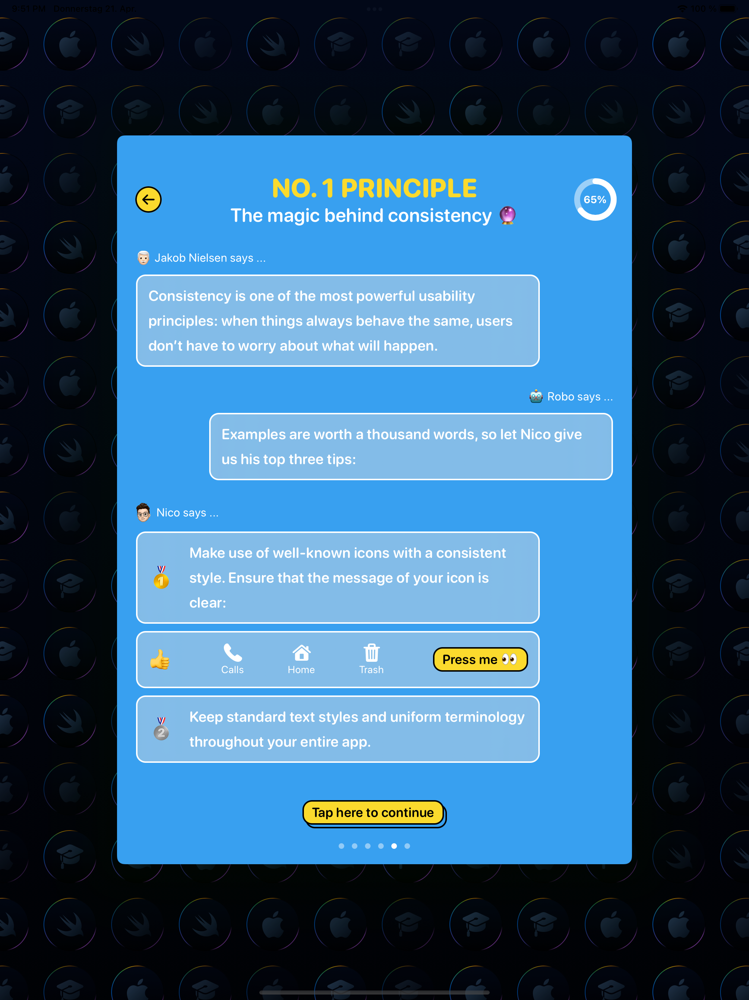
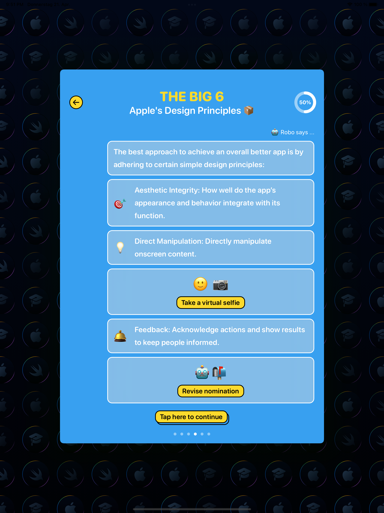
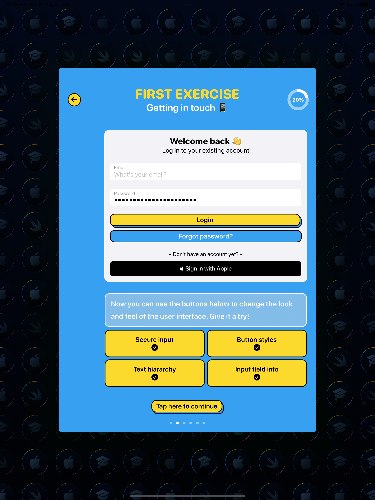

---

## 👀 A First Overview

Welcome to this year's **WWDC22** Swift Student Challenge! I'm very proud to present you my submission called `Do U(ser) Experience`. I wanted to take part in this challenge to deepen my newly gained coding skills and learn more about the amazing world of app development with Swift and SwiftUl.

Have you ever heard of the term "user experience"? If not, my Swift Playgrounds app is a great place for you to start! Your tutor Robo is there to help you exploring the vast world of user experience within three minutes by giving you an interactive tour across several different interesting topics - So, what are you waiting for? Let's get ready!

I always enjoy figuring out something new and try to gain more and more experience to get better at what I do every day. Looking for a new challenge, this year's Swift Student Challenge came just at the right time for me: My chance to create a small project just using the iPad with the brand new "app mode" of the Swift Playgrounds app - No sooner said than done! With this project I want to show other people how important user experience is, especially when it comes to apps. The playful approach with a lot of examples makes it even easier for first-time explorers.

## 📱 Used Technologies
* Swift Playgrounds App for iPads
* Swift & SwiftUI
* Authentication Services

## ⚙️ System Requirements
_Developed and tested with_
* Swift Playgrounds 4.0.2 on iPadOS 15.4

## 🎊 Sneak Peek
 
 
 
